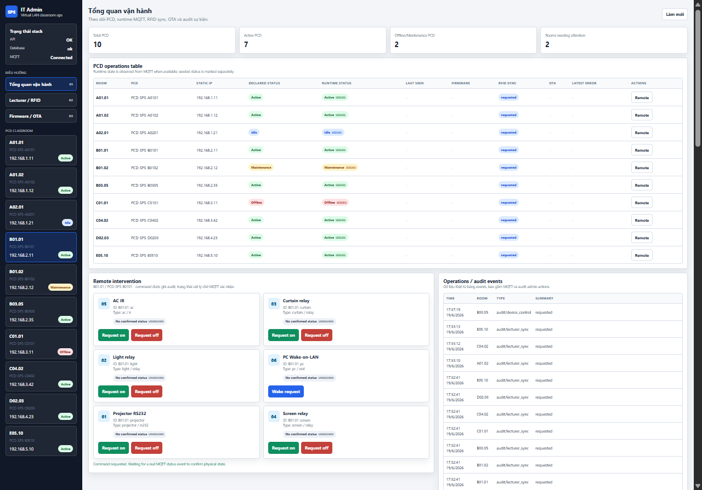
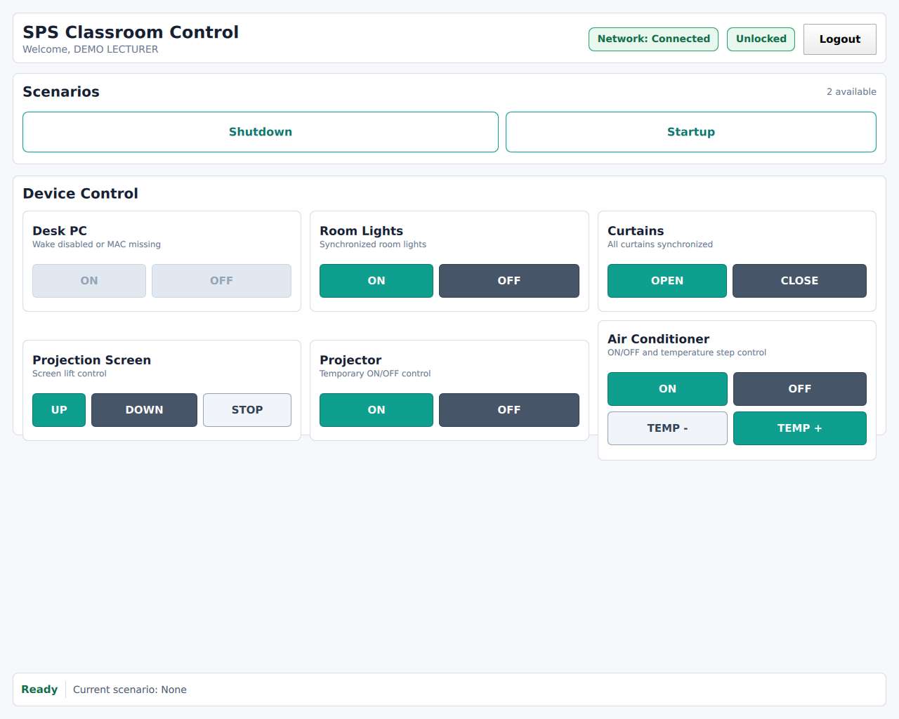

# SPS - Smart Podium System

SPS, viết tắt của Smart Podium System, là hệ thống bục giảng thông minh dùng để xác thực giảng viên, điều khiển thiết bị trong phòng học và cho phép IT Admin giám sát hoặc điều khiển từ xa qua server nội bộ của trường.

Mục tiêu thiết kế là một hệ thống offline-first: khi mất kết nối tới server, thiết bị đặt tại bục giảng vẫn xác thực thẻ RFID và điều khiển các thiết bị trong phòng học bình thường.

## 1. Bức tranh tổng thể

Một phòng học có một PCD, tức Podium Control Device. PCD là hệ thống lai gồm Raspberry Pi chạy Linux và STM32 làm bộ điều khiển thời gian thực.

```text
                         Local Server của trường
              Docker: Node API + Web Dashboard + PostgreSQL + Mosquitto
                         | MQTT: telemetry/commands
                         | HTTP: OTA packages
                         v
+----------------------------------------------------------------+
| PCD - Podium Control Device                                    |
|                                                                |
|  Raspberry Pi / Embedded Linux / Qt6                           |
|  +----------------------------------------------------------+  |
|  | appHmi                                                  |  |
|  | Qt/QML kiosk UI trên màn hình cảm ứng                   |  |
|  +----------------------------------------------------------+  |
|              | D-Bus system bus                               |
|  +-----------+------------+------------+------------+-------+  |
|  | svcAuthentication     svcAutoEngine  svcNetworkManager   |  |
|  | RFID + lecturer DB    scenario FSM   MQTT + WoL          |  |
|  |                                                           |  |
|  | svcProtocolRouter     svcOtaManager                      |  |
|  | UART frame to MCU     dual OTA orchestration             |  |
|  +-----------+-----------------------------------------------+  |
|              | UART: 0xAA 0x55 Len Cmd Payload CRC16           |
+--------------+-------------------------------------------------+
               v
+----------------------------------------------------------------+
| STM32 MCU firmware                                             |
| Parse UART frame, dispatch command, control relay, report state |
+----------------------------------------------------------------+
               v
    Đèn, rèm, màn chiếu, máy chiếu, điều hòa, máy tính trạm
```

### Giao diện hệ thống

#### **Web Dashboard** – quản lý phòng học, thiết bị, giảng viên và OTA firmware


#### **HMI trên PCD** – màn hình cảm ứng cho giảng viên tại bục
 |

Các vai trò chính:

| Thành phần | Chạy ở đâu | Vai trò |
| --- | --- | --- |
| SBC/Raspberry Pi | PCD | Chạy HMI, D-Bus services, mạng, OTA, dữ liệu cục bộ |
| STM32 MCU | PCD | Điều khiển relay/cảm biến theo thời gian thực |
| Local Server | Server trường | Quản lý phòng học, thiết bị, lecturer DB, MQTT, OTA |
| Màn hình cảm ứng | PCD | Giao diện kiosk cho giảng viên |
| RFID reader | Gắn vào Pi | Xác thực giảng viên tại biên |

## 2. Tổ chức mã nguồn

Chỉ liệt kê các nhánh tạo ra hoặc được đóng gói thành artifact chạy/deploy được:

```text
.
|-- firmware/                         # Artifact: firmware STM32 MCU
|
|-- linuxapp/                         # Artifact: runtime trên Raspberry Pi
|   |-- src/apps/appHmi/              # Executable: appHmi
|   |-- src/services/svcAuthentication/    # Executable: svcAuthentication
|   |-- src/services/svcAutoEngine/    # Executable: svcAutoEngine
|   |-- src/services/svcProtocolRouter/    # Executable: svcProtocolRouter
|   |-- src/services/svcNetworkManager/    # Executable: svcNetworkManager
|   |-- src/services/svcOtaManager/    # Executable: svcOtaManager
|   |-- configs/buildroot/             # Artifact: image Linux nhúng cho SBC
|
|-- server/                            # Artifact: local server stack
|   |-- Dockerfile                     # Docker image: sps-api
|   |-- docker-compose.yml             # Containers: sps-api, sps-db, sps-mqtt
|   |-- src/                           # Node.js API + MQTT worker trong sps-api
|   |-- webdashboard/public/           # Dashboard static serve tại /
|   |-- mosquitto/                     # Config broker MQTT cho container sps-mqtt
```

## 3. Kiến trúc phần mềm trên Raspberry Pi

`linuxapp/` là phần trung tâm của runtime. Hệ thống dùng kiến trúc đa tiến trình, mỗi service là một executable riêng, giao tiếp qua D-Bus system bus. Cách tách này giúp HMI không bị treo theo khi một service phần cứng hoặc mạng gặp lỗi.

| Process | D-Bus service | Target CMake | Trách nhiệm |
| --- | --- | --- | --- |
| `appHmi` | D-Bus client | `appHmi` | Render Qt/QML fullscreen kiosk, gọi service qua D-Bus |
| `svcAuthentication` | `com.sps.auth` | `svcAuthentication` | Đọc RFID, xác thực lecturer, phát trạng thái khóa/mở |
| `svcAutoEngine` | `com.sps.engine` | `svcAutoEngine` | Chạy scenario, điều phối lệnh thiết bị qua router |
| `svcProtocolRouter` | `com.sps.router` | `svcProtocolRouter` | Đóng gói/parse UART frame, retry, cache trạng thái thiết bị, OTA chunk |
| `svcNetworkManager` | `com.sps.netmgr` | `svcNetworkManager` | MQTT pub/sub, heartbeat, network status, Wake-on-LAN |
| `svcOtaManager` | `com.sps.otamanager` | `svcOtaManager` | Tải gói OTA, verify checksum, flash MCU qua router, cập nhật binary service |

Các file nền dùng chung:

| File | Ý nghĩa |
| --- | --- |
| `linuxapp/src/common/sps_service_base.*` | Base class đăng ký service/object lên D-Bus và quản lý lifecycle |
| `linuxapp/src/common/sps_constants.h` | Tên service/path/interface, UART constants, OTA constants |
| `linuxapp/src/common/sps_device_models.h` | Model `Device`, `Room`, `Lecturer`, `Scenario`, `UartFrame`, `MqttMessage` |
| `linuxapp/src/common/sps_logger.h` | Logger singleton ghi log theo component |
| `linuxapp/src/common/sps_runtime_config.h` | Helper đọc env/config path cho demo WSL và runtime nhúng |
| `linuxapp/src/interfaces/*.xml` | Hợp đồng D-Bus, từ đó Qt sinh adaptor/proxy bằng CMake |

## 4. Các luồng xử lý chính

### RFID mở khóa bục giảng

```text
Lecturer quẹt thẻ
-> svcAuthentication đọc RFID
-> kiểm tra lecturer database cục bộ
-> phát AuthStatusChanged/LecturerAuthenticated qua D-Bus
-> appHmi chuyển từ lock screen sang dashboard
```

Trong code hiện tại, `svcAuthentication` đọc `/opt/sps/config/lecturers.json` và có dữ liệu demo fallback khi file chưa tồn tại. Thiết kế mục tiêu của dự án là chuyển lớp dữ liệu cục bộ này sang SQLite ở chế độ WAL để vẫn đọc được khi service đồng bộ dữ liệu đang ghi.

### Giảng viên điều khiển thiết bị tại phòng

```text
appHmi
-> svcAutoEngine ExecuteScenario hoặc ControlDevice
-> svcProtocolRouter SendCommand
-> UART frame sang STM32
-> MCU điều khiển relay/cảm biến
-> ACK/NACK hoặc status quay lại qua UART
-> D-Bus signal cập nhật HMI/service khác
```

`svcAutoEngine` hiện đã load scenario từ `/opt/sps/config/scenarios.json` và có scenario demo fallback. Lệnh cuối cùng được map sang UART command như `LIGHT_CONTROL`, `PROJECTOR_CONTROL`, `AC_CONTROL`.

### IT Admin điều khiển từ server

```text
Dashboard/API server
-> REST API /api/rooms/{roomId}/...
-> MQTT topic sps/{room}/cmd/...
-> svcNetworkManager nhận message
-> phát command nội bộ hoặc gọi service liên quan
-> router/engine điều khiển thiết bị
-> publish trạng thái/event ngược lại MQTT
```

MQTT topic đang được chuẩn hóa trong `mqtt_defines.h`, ví dụ:

| Topic | Ý nghĩa |
| --- | --- |
| `sps/{RoomID}/status/devices` | Snapshot trạng thái thiết bị |
| `sps/{RoomID}/status/connection` | Heartbeat/LWT kết nối |
| `sps/{RoomID}/event/auth` | Sự kiện xác thực |
| `sps/{RoomID}/event/ota` | Tiến độ OTA |
| `sps/{RoomID}/cmd/projector` | Lệnh máy chiếu |
| `sps/{RoomID}/cmd/relay` | Lệnh relay/đèn/rèm |
| `sps/{RoomID}/cmd/ac` | Lệnh điều hòa |
| `sps/{RoomID}/cmd/sync` | Đồng bộ lecturer/config |
| `sps/{RoomID}/cmd/ota` | Kích hoạt OTA |

Ở phía server, `mqttWorker` subscribe `sps/+/event/#` và `sps/+/status/#` để ghi event/status vào PostgreSQL, đồng thời các API điều khiển sẽ publish lệnh về topic `sps/{roomId}/cmd/{commandType}`.

### Dual OTA

```text
Server gửi URL + checksum
-> svcOtaManager tải package bằng HTTP
-> verify SHA-256 nếu có checksum
-> nếu là MCU firmware: gọi svcProtocolRouter StartOTA/SendOTAChunk/EndOTA
-> nếu là Linux app: stop service, backup binary, replace binary, start service
-> phát UpdateProgress/UpdateCompleted qua D-Bus
```

Các binary runtime mục tiêu nằm ở `/opt/sps/bin`, file tải tạm ở `/opt/sps/updates`, version ở `/opt/sps/config/version.json`.

## 5. Giao thức nội bộ

### D-Bus

D-Bus là xương sống IPC giữa các tiến trình trên Pi. Contract chính nằm trong `linuxapp/src/interfaces/*.xml`; các service C++ đăng ký cùng service name và object path tương ứng.

| Service | Object path | Interface | Vai trò |
| --- | --- | --- | --- |
| `com.sps.auth` | `/com/sps/auth` | `com.sps.auth` | Xác thực RFID, lock/unlock HMI |
| `com.sps.engine` | `/com/sps/engine` | `com.sps.engine` | Chạy scenario và điều phối command |
| `com.sps.router` | `/com/sps/router` | `com.sps.router` | Bridge D-Bus sang UART MCU |
| `com.sps.netmgr` | `/com/sps/netmgr` | `com.sps.netmgr` | MQTT, network status, Wake-on-LAN |
| `com.sps.otamanager` | `/com/sps/otamanager` | `com.sps.otamanager` | Điều phối OTA MCU firmware và Linux app |

Các method/signal chính theo XML:

| Interface | Methods | Signals |
| --- | --- | --- |
| `com.sps.auth` | `GetAuthStatus() -> i`, `UnlockScreen(s rfidData) -> b`, `LockScreen() -> b`, `GetAuthenticatedLecturer() -> s` | `AuthStatusChanged(i)`, `LecturerAuthenticated(s,x)`, `AuthenticationFailed(s)` |
| `com.sps.engine` | `GetAvailableScenarios() -> as`, `ExecuteScenario(s) -> b`, `GetScenarioStatus(s) -> s`, `StopScenario(s) -> b`, `GetScenarioInfo(s) -> s,s,i`, `ControlDevice(y,s) -> b`, `RegisterContextTrigger(s,s) -> b`, `GetEngineStatus() -> s` | `ScenarioStarted(s)`, `ScenarioCompleted(s)`, `ScenarioError(s,s)`, `CommandExecuting(s,i,s)`, `ContextTriggered(s,s)` |
| `com.sps.router` | `ControlLight(y,b) -> b`, `ControlCurtain(y,y) -> b`, `ControlProjector(b) -> b`, `ControlAC(y,b) -> b`, `IncreaseACTemperature(y) -> b`, `DecreaseACTemperature(y) -> b`, `SendCommand(y,ay) -> b`, `GetDeviceStatus(y) -> y`, `GetConnectionStatus() -> s`, `ResetConnection() -> b`, `StartOTA(u) -> b`, `SendOTAChunk(q,ay) -> b`, `EndOTA() -> b` | `ConnectionStatusChanged(s)`, `CommandAcknowledged(y)`, `CommandError(y,y)`, `DeviceStatusChanged(y,y)`, `PresenceDetected(b)`, `OTAProgress(i)` |
| `com.sps.netmgr` | `GetNetworkStatus() -> s`, `GetMqttStatus() -> s`, `PublishEvent(s,ay,i) -> b`, `GetRoomId() -> s`, `SetRoomId(s) -> b`, `SendWakeOnLAN(s,s) -> b`, `SyncLecturerList() -> b`, `GetConnectionDetails() -> s,s,s`, `RequestOTAUpdate(s) -> b`, `IsPcControlEnabled() -> b`, `GetPcMacAddress() -> s` | `NetworkConnected(s)`, `NetworkDisconnected(s)`, `MqttConnected()`, `MqttDisconnected(s)`, `MqttMessageReceived(s,ay)`, `CommandReceived(s,ay)`, `LecturerListUpdated(i)`, `OTAUpdateAvailable(s,s)` |
| `com.sps.otamanager` | `GetOtaStatus() -> s`, `StartMcuFirmwareUpdate(s,s) -> b`, `StartAppServiceUpdate(s,s,s) -> b`, `StartFullUpdate(s,s,s,s) -> b`, `GetUpdateProgress() -> i`, `GetCurrentVersion() -> s`, `CancelUpdate() -> b` | `UpdateStatusChanged(s)`, `UpdateProgress(i,s)`, `UpdateCompleted(b,s)`, `McuFirmwareUpdateRequired(s,s)` |

Ghi chú kiểu D-Bus: `s` là string, `b` boolean, `i` int32, `u` uint32, `q` uint16, `y` byte, `x` int64, `ay` byte array, `as` string array.

`svcNetworkManager` hiện còn một số method compatibility trong header C++ chưa được ghi vào XML: `ConnectToMqtt`, `DisconnectFromMqtt`, `PublishDeviceStatus`, overload `PublishEvent(roomId,eventType,eventJson)` và `SendWoL`. Nếu dùng Qt generated proxy từ XML thì cần đồng bộ các method này vào `com.sps.netmgr.xml`.

### UART SBC-MCU

Frame UART giữa Raspberry Pi và STM32:

```text
[0xAA][0x55][Length][CmdId][SeqId][Payload...][CRC16 low][CRC16 high]
```

Thông số hiện tại:

| Thuộc tính | Giá trị |
| --- | --- |
| Baudrate | `115200` |
| Serial format | `8N1`, parity `None`, flow control `None` |
| Port mặc định trên Pi | `/dev/ttyS0`, override bằng `SPS_UART_PORT` |
| `Length` | Số byte payload, không tính header/cmd/seq/crc |
| `SeqId` | Transaction sequence ID, tăng dần ở `svcProtocolRouter` để match ACK/NACK |
| CRC | CRC-16/CCITT, init `0xFFFF`, polynomial `0x1021` |
| Vùng CRC | `Length + CmdId + SeqId + Payload` |
| Thứ tự CRC trên wire | Little-endian: low byte trước, high byte sau |
| Payload tối đa phía linuxapp | `255` bytes |
| Frame tối thiểu | `7` bytes |
| OTA chunk | `128` bytes |

Command ID chính:

| Command | Hex | Ý nghĩa |
| --- | --- | --- |
| `PING_HEARTBEAT` | `0x10` | Kiểm tra MCU còn sống |
| `ACK_ALIVE` | `0x11` | MCU ACK command |
| `NACK_ERROR` | `0x12` | MCU báo lỗi |
| `LIGHT_CONTROL` | `0x21` | Điều khiển đèn/relay |
| `CURTAIN_CONTROL` | `0x22` | Điều khiển rèm/màn |
| `PROJECTOR_CONTROL` | `0x23` | Điều khiển máy chiếu |
| `AC_CONTROL` | `0x24` | Điều khiển điều hòa |
| `AC_TEMP_UP` | `0x25` | Tăng nhiệt độ điều hòa một bước |
| `AC_TEMP_DOWN` | `0x26` | Giảm nhiệt độ điều hòa một bước |
| `QUERY_RELAY_STATUS` | `0x32` | Đọc trạng thái relay |
| `PRESENCE_ALERT` | `0x41` | Sự kiện cảm biến hiện diện |
| `OTA_START`, `OTA_DATA_CHUNK`, `OTA_END` | `0x50`-`0x52` | Nạp firmware MCU |

Payload contract chính:

| Command | Payload |
| --- | --- |
| `PING_HEARTBEAT` | Rỗng |
| `ACK_ALIVE` | `[originalCmdId][originalSeqId]` |
| `NACK_ERROR` | `[originalCmdId][originalSeqId][errorCode]` |
| `LIGHT_CONTROL` | `[lightId][value]`, `value`: `0x00` off, `0x01` on |
| `CURTAIN_CONTROL` | `[curtainOrScreenId][action]`, `action`: `0x00` close, `0x01` open, `0x02` stop |
| `PROJECTOR_CONTROL` | `[value]`, `0x00` off, `0x01` on |
| `AC_CONTROL` | `[acId][value]`, `0x00` off, `0x01` on |
| `AC_TEMP_UP` | `[acId]` |
| `AC_TEMP_DOWN` | `[acId]` |
| `QUERY_RELAY_STATUS` | Request `[deviceId]`, response `[deviceId][status]` |
| `PRESENCE_ALERT` | `[isPresent]`, `0x00` false, non-zero true |
| `OTA_START` | `[firmwareSize uint32 little-endian]` |
| `OTA_DATA_CHUNK` | `[chunkNumber uint16 little-endian][128 bytes data]` |
| `OTA_END` | Rỗng |

Device ID và error code đang dùng:

| Nhóm | Giá trị |
| --- | --- |
| Light IDs | `LIGHT_PODIUM=0x01`, `LIGHT_CLASS=0x02`, `LIGHT_ALL=0xFF` |
| Curtain/screen IDs | `CURTAIN=0x01`, `SCREEN=0x02` |
| AC ID | `AC_ID=0x01` |
| Error codes | `CRC_ERROR=0x01`, `INVALID_PARAM=0x02`, `UNSUPPORTED_CMD=0x03`, `BUSY=0x04`, `OTA_WRITE_FAILED=0x05`, `TIMEOUT=0x06` |

Nguồn contract phía Linux là `linuxapp/src/common/sps_uart_protocol.h` và `linuxapp/src/services/svcProtocolRouter/uart_frame.*`. File `firmware/sps_protocol.h` hiện vẫn là contract firmware tối giản hơn, chưa có `SeqId`, projector/AC/OTA đầy đủ; khi tích hợp MCU thật cần đồng bộ firmware theo contract Linux ở trên.

## 6. Backend server

`server/` là stack chạy trên server nội bộ của trường:

| Container | Công nghệ | Vai trò |
| --- | --- | --- |
| `sps-db` | PostgreSQL 16 | Master DB cho lecturer, room, device, event |
| `sps-mqtt` | Eclipse Mosquitto | Broker MQTT cho telemetry/command |
| `sps-api` | Node.js/Express | REST API, dashboard web, MQTT worker và điểm phát OTA package |

Server hiện đã có schema PostgreSQL tối thiểu và tự khởi tạo khi API start:

| Bảng | Nội dung |
| --- | --- |
| `lecturers` | Giảng viên, RFID, trạng thái được phép sử dụng |
| `rooms` | Danh sách phòng demo, tên và vị trí |
| `devices` | Thiết bị theo phòng, loại thiết bị, trạng thái, metadata như kênh relay |
| `events` | Event/status nhận từ MQTT để dashboard hoặc API đọc lại về sau |

Các module chính:

| File | Vai trò |
| --- | --- |
| `server/src/server.js` | Express app, REST API, serve dashboard ở `/`, serve OTA static ở `/ota` |
| `server/src/db.js` | Tạo schema, seed phòng/thiết bị demo, CRUD lecturer, room/device query |
| `server/src/mqttWorker.js` | Kết nối Mosquitto, ghi event/status vào DB, publish command/sync/OTA |
| `server/webdashboard/public/index.html` | Dashboard quản trị phòng, thiết bị, giảng viên và OTA qua API chính |
| `server/webdashboard/server.js` | Prototype dashboard độc lập dùng JSON local, giữ lại để tham khảo/demo cũ |

REST API chính:

| Endpoint | Vai trò |
| --- | --- |
| `GET /health` | Trạng thái API, PostgreSQL và MQTT |
| `GET /api/lecturers` | Danh sách giảng viên |
| `POST /api/lecturers` | Thêm/cập nhật giảng viên với `id`, `name`, `rfid` |
| `PUT /api/lecturers/:lecturerId` | Cập nhật giảng viên |
| `DELETE /api/lecturers/:lecturerId` | Xóa giảng viên |
| `GET /api/rooms` | Danh sách phòng và số thiết bị đang bật |
| `GET /api/overview` | Tổng quan IT Admin cho PCD, runtime MQTT, RFID sync, OTA và lỗi gần nhất |
| `GET /api/events?roomId=&limit=` | Danh sách event/audit gần nhất từ bảng events |
| `GET /api/rooms/:roomId/config` | Cấu hình phòng kèm danh sách thiết bị |
| `GET /api/rooms/:roomId/devices` | Danh sách thiết bị trong phòng |
| `POST /api/rooms/:roomId/commands` | Publish command tùy ý qua MQTT |
| `POST /api/rooms/:roomId/devices/:deviceId/control` | Gửi remote intervention command, ghi audit, chờ status event xác nhận trạng thái vật lý |
| `POST /api/rooms/sync` | Gửi danh sách lecturer hiện tại xuống toàn bộ PCD |
| `POST /api/rooms/:roomId/sync` | Gửi danh sách lecturer hiện tại xuống PCD |
| `GET /api/ota` | Liệt kê file OTA trong `OTA_DIR` |
| `POST /api/rooms/:roomId/ota` | Publish lệnh OTA gồm `version`, `url`, `checksum` |
| `GET /ota/:file` | Tải package OTA qua HTTP |

## 7. Firmware STM32

`firmware/` chứa contract và header cho firmware STM32F4:

| File | Vai trò |
| --- | --- |
| `sps_protocol.h` | Parser state machine, frame format, ACK/NACK, error code |
| `command_dispatcher.h` | API nhận frame đã parse để dispatch command |
| `relay_service.h` | Device/action/status cho relay đèn, rèm, màn |
| `main.h`, `gpio.h`, `usart.h` | STM32 HAL/LL pin và peripheral declarations |
| `FreeRTOSConfig.h` | Cấu hình FreeRTOS |

Firmware nhận frame từ `svcProtocolRouter`, thực thi trên relay/cảm biến, rồi gửi ACK/NACK hoặc trạng thái ngược lại.

## 8. Build và chạy nhanh

### Linux app native build

Trên Ubuntu/Debian:

```bash
cd linuxapp
./scripts/setup_dev_env.sh --build
```

Hoặc build thủ công:

```bash
cmake -S linuxapp -B linuxapp/build -G Ninja -DCMAKE_BUILD_TYPE=Debug
cmake --build linuxapp/build --parallel
```

Các executable được sinh vào `linuxapp/build/bin/`.

### Demo WSL khi không có Raspberry Pi

Build linuxapp trước:

```bash
cmake -S linuxapp -B linuxapp/build -G Ninja -DCMAKE_BUILD_TYPE=Debug
cmake --build linuxapp/build --parallel
```

Chạy toàn bộ service trong một D-Bus session tạm:

```bash
bash linuxapp/scripts/run_wsl_demo.sh --no-hmi
```

Bỏ `--no-hmi` nếu muốn mở luôn giao diện Qt/QML. Mặc định script sẽ mở một tmux dashboard gồm 6 pane log nhỏ và 1 pane để thao tác lệnh demo. Trong pane command có sẵn:

```bash
fake-rfid RFID001
scenario-startup
router-status
stop-demo
```

Nếu cần chạy kiểu terminal cũ, thêm `--no-tmux`.

Script mặc định dùng:

| Biến môi trường | Mặc định | Ý nghĩa |
| --- | --- | --- |
| `SPS_CONFIG_DIR` | `linuxapp/config/demo` | Config demo cho lecturer/scenario/network |
| `SPS_LOG_DIR` | `./logs` | Nơi ghi log runtime |
| `SPS_UART_PORT` | `/dev/ttyUSB0` | USB-TTL nối MCU |
| `SPS_ENABLE_PC_CONTROL` | `0` | Tắt WoL trong demo WSL |
| `SPS_PC_MAC` | rỗng | MAC máy tính phòng học khi bật WoL |
| `SPS_TMUX_SESSION` | `sps-wsl-demo` | Tên tmux session dashboard |

Fake một lần quẹt RFID từ terminal khác bằng địa chỉ D-Bus mà script in ra:

```bash
DBUS_SYSTEM_BUS_ADDRESS='<copy-from-run-script>' \
python3 linuxapp/scripts/fake_rfid_auth.py --uid RFID001
```

Hoặc dùng fallback `qdbus` trong cùng D-Bus session:

```bash
qdbus --system com.sps.auth /com/sps/auth com.sps.auth.UnlockScreen RFID001
```

Theo dõi log:

```bash
bash linuxapp/scripts/tail_sps_logs.sh
```

Muốn bật lại Wake-on-LAN khi phần cứng sẵn sàng:

```bash
SPS_ENABLE_PC_CONTROL=1 SPS_PC_MAC='aa:bb:cc:dd:ee:ff' bash linuxapp/scripts/run_wsl_demo.sh
```

### Server

```bash
cd server
docker compose up --build
```

Sau khi chạy:

| Service | Port |
| --- | --- |
| API | `3000` |
| PostgreSQL | `5432` |
| MQTT | `1883` |

Health check:

```bash
curl http://localhost:3000/health
```

Dashboard web chạy cùng API tại:

```text
http://localhost:3000/
```

Một số lệnh API nhanh:

```bash
curl http://localhost:3000/api/rooms
curl http://localhost:3000/api/rooms/room101/config
curl -X POST http://localhost:3000/api/lecturers \
  -H 'Content-Type: application/json' \
  -d '{"id":"L001","name":"Demo Lecturer","rfid":"RFID001","authorized":true}'
curl -X POST http://localhost:3000/api/rooms/room101/devices/room101-device-a/control \
  -H 'Content-Type: application/json' \
  -d '{"state":"on"}'
```

Biến môi trường server thường dùng:

| Biến | Mặc định | Ý nghĩa |
| --- | --- | --- |
| `PORT` | `3000` | Port HTTP API/dashboard |
| `DB_HOST`, `DB_PORT` | `localhost`, `5432` | Địa chỉ PostgreSQL khi chạy ngoài Docker |
| `DB_USER`, `DB_PASSWORD`, `DB_NAME` | `sps`, `sps_secret`, `sps_db` | Thông tin database |
| `MQTT_HOST`, `MQTT_PORT` | `localhost`, `1883` | Broker MQTT |
| `OTA_DIR` | `server/ota` | Thư mục chứa file OTA để serve qua `/ota` |
| `DASHBOARD_DIR` | `server/webdashboard/public` | Static dashboard được Express serve |

Từ thư mục gốc repo, giả lập nhiều PCD gửi event/status lên MQTT:

```bash
pip install paho-mqtt
python tools/device-simulator.py --count 3 --broker localhost --port 1883 --prefix room --interval 5
```

### Integration test CLI

```bash
pip install -r tests/requirements.txt
python tests/integration/sps_integration_tester.py list
python tests/integration/sps_integration_tester.py run TC-01
python tests/integration/sps_integration_tester.py run --all
```

Các test này giả lập/kiểm tra các luồng D-Bus, MQTT và UART ở mức tích hợp. Muốn test pass đầy đủ cần các service SPS đang chạy trên D-Bus system bus.

## 9. Hiện trạng quan trọng trong mã nguồn

Những điểm đã có:

- CMake build cho 6 executable chính của `linuxapp/`.
- D-Bus XML interface cho auth, engine, router, network, OTA.
- UART frame builder/parser với CRC-16, receive buffer và retry command queue.
- Qt/QML HMI fullscreen kiosk, có màn hình khóa và dashboard điều khiển cơ bản.
- OTA manager có flow tải file, checksum, flash MCU qua router và thay binary service.
- `svcNetworkManager` có MQTT client TCP cơ bản, topic pub/sub, heartbeat/LWT và Wake-on-LAN có thể bật/tắt bằng config.
- Docker Compose cho PostgreSQL, Mosquitto và Node API/dashboard.
- Backend có schema PostgreSQL tối thiểu, REST API quản lý lecturer/room/device, MQTT worker và OTA static file server.
- Web dashboard static được serve trực tiếp từ API ở `/`.
- Tool `tools/device-simulator.py` để tạo nhiều PCD giả lập qua MQTT.
- Integration tester CLI mô tả các kịch bản end-to-end.

Những điểm còn là scaffold hoặc cần hoàn thiện:

- `svcAuthentication` đang dùng JSON demo thay vì SQLite WAL.
- MQTT client phía `linuxapp` đang là implementation tối thiểu trên `QTcpSocket`, cần test thêm với broker thật, reconnect dài hạn, QoS/edge case và bảo mật.
- Backend chưa có auth/session cho dashboard, phân quyền admin, migration framework, API đọc event lịch sử và realtime dashboard.
- `appHmi` còn luồng demo login/fake RFID phục vụ WSL; cần kiểm thử lại trên màn hình cảm ứng thật.
- `firmware/` hiện chủ yếu là header/contract, chưa thấy đầy đủ source `.c` trong repo.
- Buildroot config hiện có tên `sps_pi_3_64_defconfig`; nếu target cuối là Raspberry Pi 4 cần kiểm tra lại defconfig, kernel DTS và firmware package tương ứng.

## 10. Quy ước làm việc nhóm

- Tính năng mới nên phát triển trên nhánh riêng, ví dụ `feature/ir_task`.
- Khi code đã build được và không còn lỗi vặt, tạo merge request vào nhánh `develop`.
- Khi các phần web, firmware, linux app và docs ổn định, merge `develop` vào `main` để release.
